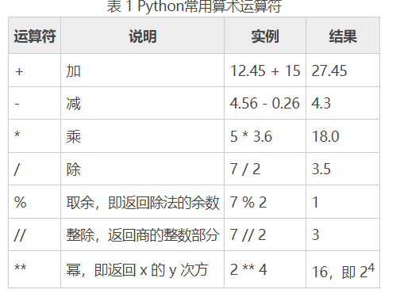

## 单元一
#### 1、pyton的主要特点：易于学习，易于阅读，易于维护啊，拥有丰富的标准库，支持互动模式。
#### 2、>>> 此符号为提示符。
#### 3、${user}表示当前系统的用户名称,${DATE}表示当前开发时间,${NAME}表示文件名称, ${PRODUCE_NAME}表示开发工具, UTF-8表示中文编码格式。
#### 4、一个tab等于四个空格。
#### 5、空行：函数之间或类方法之间用空行分隔，表示一段新的代码的开始。
#### 6、\ 用来实现多行语句。
#### 7、单行注释用 (#) 多行注释用三个单引号(''')
#### 8、input()函数的使用方法：默认标准是输入键盘。

## 单元二
### (一)python的命名规则
#### 1、标识符中的第一个字符必须是英文字母(A~Z 和 a~z)或者下划线“_”,第二个字符的开始可以字母或者下画线"_"
#### 2、标识符不能以数字开头，也不能包含空格以及 @、%、$ 等特殊字符
#### 3、允许使用汉字作为标识符，但是要尽量避免，因为可能会许多奇怪的错误。
#### 4、不能将python保留字和内置函数名作为标识符和名称。例如print等，但标识符名称可以包含关键字
#### 5、不要命名以双下划线开头和结尾的变量，这是python的专用标识符
### （二）python的基本数据类型
#### 1、数据类型：(number)、字符串(string)、列表(list)、元组(tuple)、集合(set)、字典(dicitionary)
#### 2、数值：整形(int)、浮点数(float)、复数(complex)、布尔值(bool)
#### 3、字符串的表达方式：word='字符串' sentence='这是一个句子' paragraph="""这是一个段落，可以由多行组成"""
#### 4、整数可以是正整数，负整数也可以是0，但是不带小数点，浮点数是由整数的部分与小数部分组成的。复数是由虚数和实数部分构成的，布尔值用数字0表示
### (三)python常用数据据类型转换函数

### (四)python算术运算符和运行优先级及其实例
高低排序为:第1级：** 第2级:*、/、%、// 第3级：+、-(同级别运算符从左至右计算()里的可以调整优先级也可以部分优先运算)
 ### 数值类型

