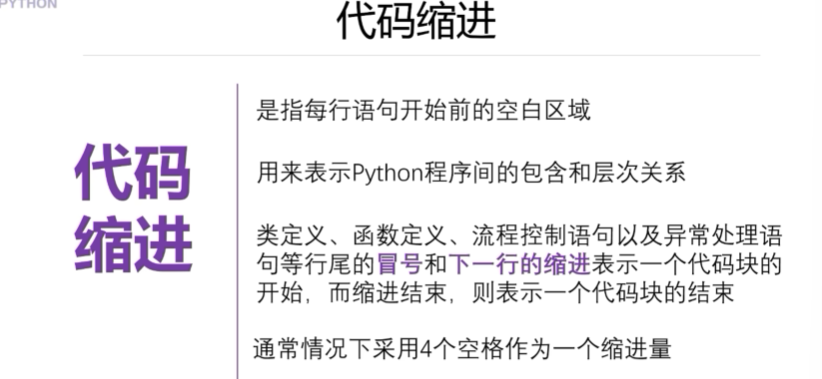
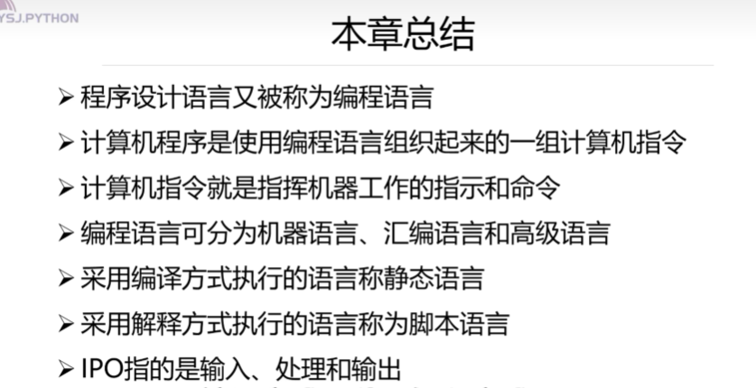
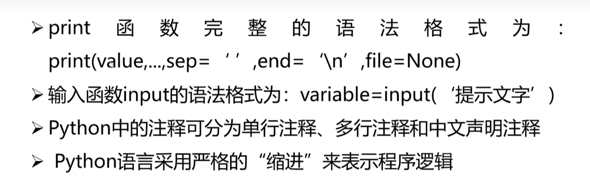
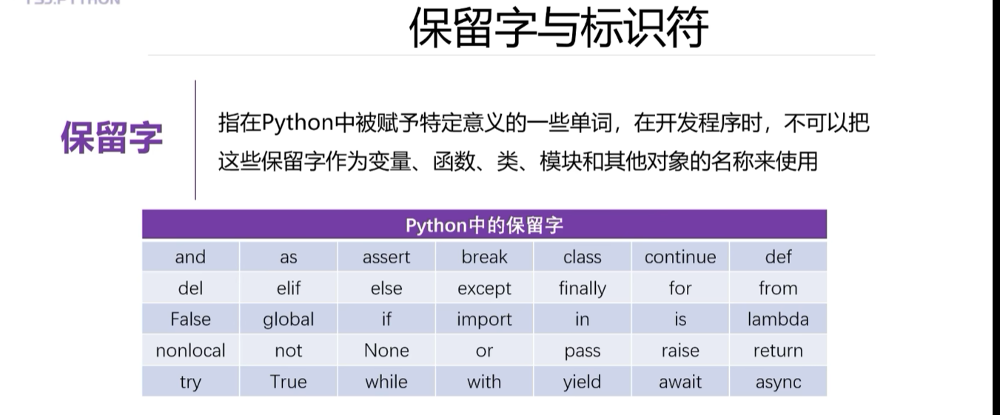
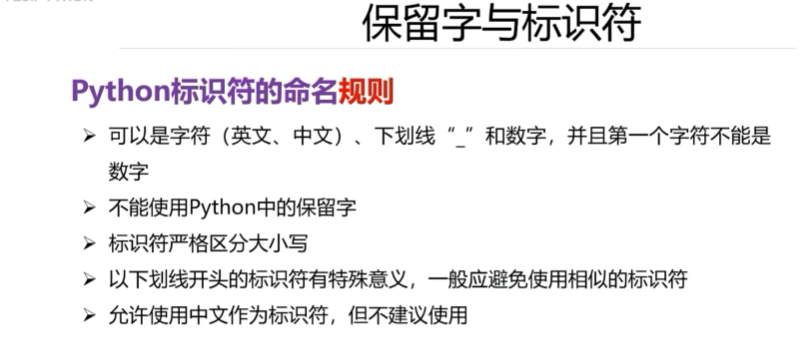
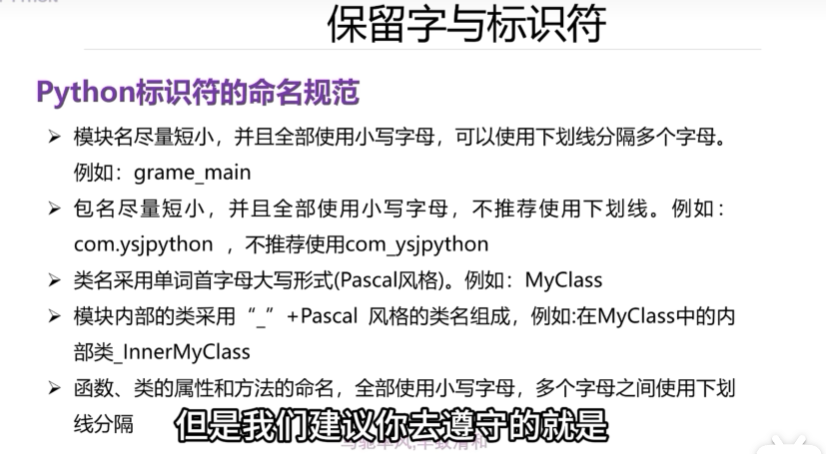
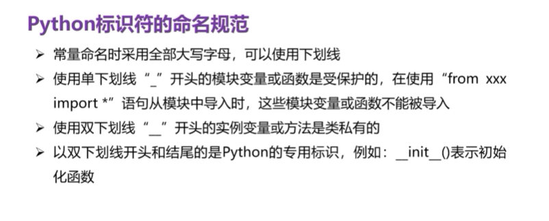

# 第一章:
**初始IPO程序编写方法:**  
  
输入数据、处理数据、输出数据  
***  
**基本的输出函数:**  
  
**基本的输入函数:**  
  
***  
**python当中的注释:**  
  
***
**代码的缩进:**  
  
*非常重要*    

**本章总结**  
  
  
**章节习题**  
https://reurl.cc/jQoxRm  

# 第二章:  
**python当中的保留字:**  
  
**python中的标识符**  
  
  

